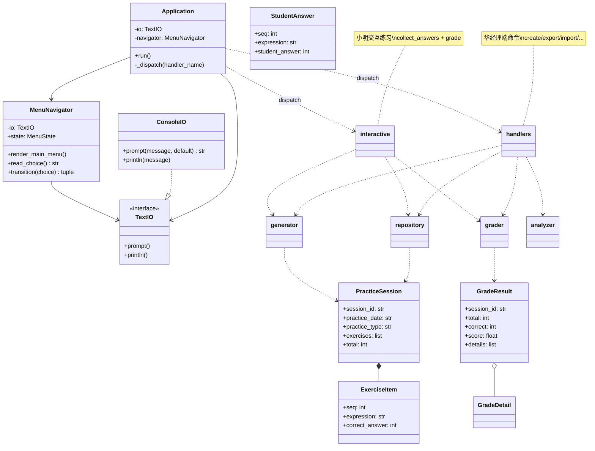

# 类结构 UML 图

## 模块分层

| 层 | 模块 | 职责 |
|----|------|------|
| 入口 | `main.py` | 唯一 `main()` |
| 应用 | `app.Application` | 主循环、调度 |
| 交互 | `menu`, `io`, `handlers`, `interactive` | CLI 与用户输入 |
| 领域 | `generator`, `grader`, `analyzer`, `export` | 业务逻辑 |
| 数据 | `repository`, `models`, `parsers` | 持久化与解析 |
| 横切 | `contracts`, `exceptions`, `constants` | 契约、异常、配置 |
