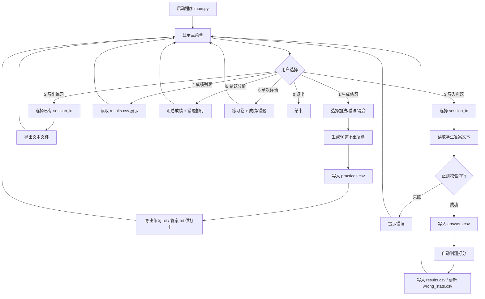
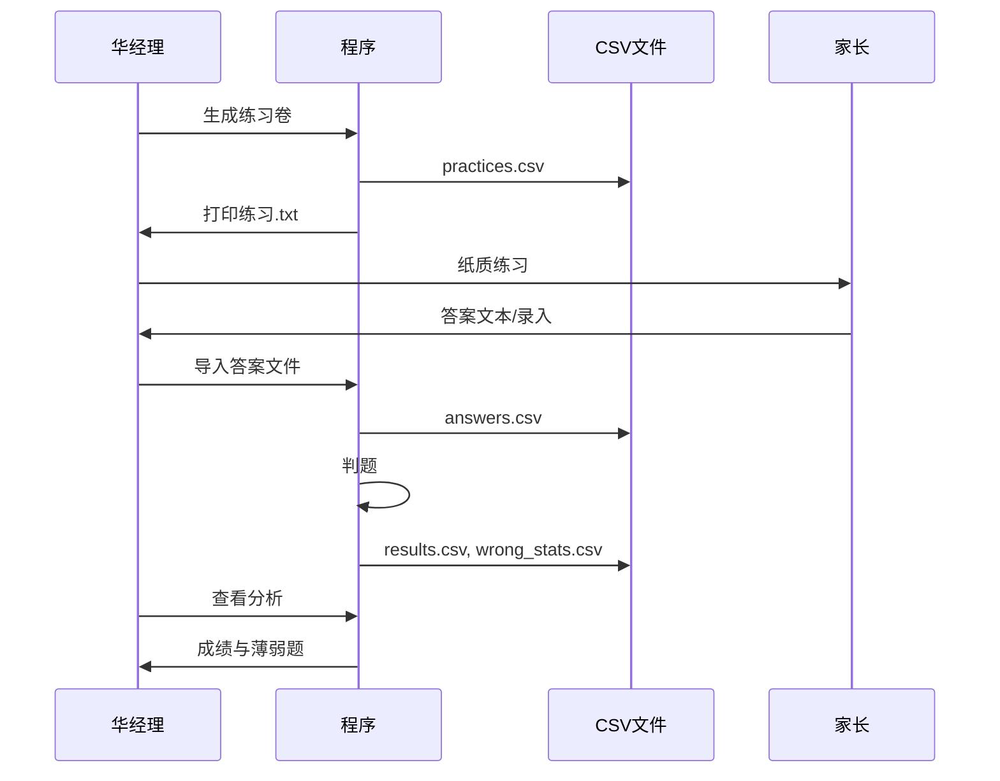

# 数据处理交互流程图

```mermaid
flowchart TD
    A[启动程序 main.py] --> B[显示主菜单]
    B --> C{用户选择}
    C -->|1 生成练习| D[选择加法/减法/混合]
    D --> E[生成50道不重复题]
    E --> F[写入 practices.csv]
    F --> G[导出练习.txt / 答案.txt 供打印]
    G --> B
    C -->|2 导出练习| H[选择已有 session_id]
    H --> I[导出文本文件]
    I --> B
    C -->|3 导入判题| J[选择 session_id]
    J --> K[读取学生答案文本]
    K --> L{正则校验每行}
    L -->|失败| M[提示错误]
    M --> B
    L -->|成功| N[写入 answers.csv]
    N --> O[自动判题打分]
    O --> P[写入 results.csv / 更新 wrong_stats.csv]
    P --> B
    C -->|4 成绩列表| Q[读取 results.csv 展示]
    Q --> B
    C -->|5 错题分析| R[汇总成绩 + 错题排行]
    R --> B
    C -->|6 单次详情| S[练习卷 + 成绩/错题]
    S --> B
    C -->|0 退出| T[结束]
```

## 角色与数据流

```mermaid
sequenceDiagram
    participant M as 华经理
    participant P as 程序
    participant CSV as CSV文件
    participant Mom as 家长

    M->>P: 生成练习卷
    P->>CSV: practices.csv
    P->>M: 打印练习.txt
    M->>Mom: 纸质练习
    Mom->>M: 答案文本/录入
    M->>P: 导入答案文件
    P->>CSV: answers.csv
    P->>P: 判题
    P->>CSV: results.csv, wrong_stats.csv
    M->>P: 查看分析
    P->>M: 成绩与薄弱题
```
