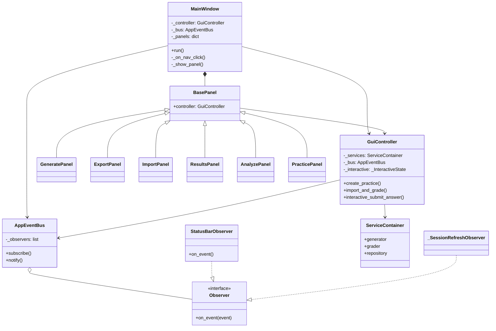

# GUI 类图结构（第7部分）

## MVC 分层

| 层 | 模块 |
|----|------|
| View | `main_window.py`, `panels.py`（tkinter） |
| Controller | `controller.py` |
| Model / Service | `ServiceContainer` + `services/*` |
| 事件总线 | `events.py`（Observer） |

## GUI 测试策略

GUI 窗口不直接自动化点击（避免 fragile UI 测试），改为：

1. **Controller 测试** — `tests/test_gui_controller.py`
2. **Observer 测试** — `tests/test_gui_events.py`
3. **回归** — 全量 `pytest` 保证服务层不被破坏

若需 UI 自动化，可后续引入 `pytest-qt` 或录制脚本，本案例采用 **Controller 分离** 作为教程要求的替代方案。
