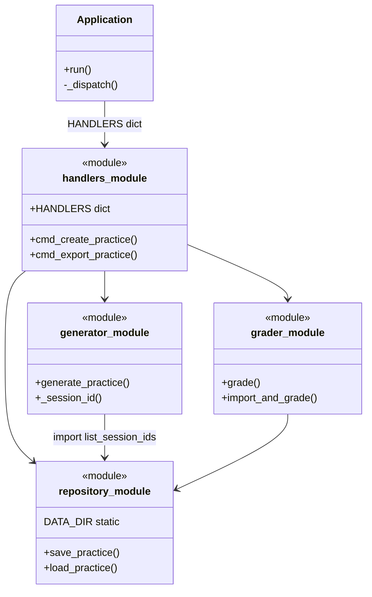
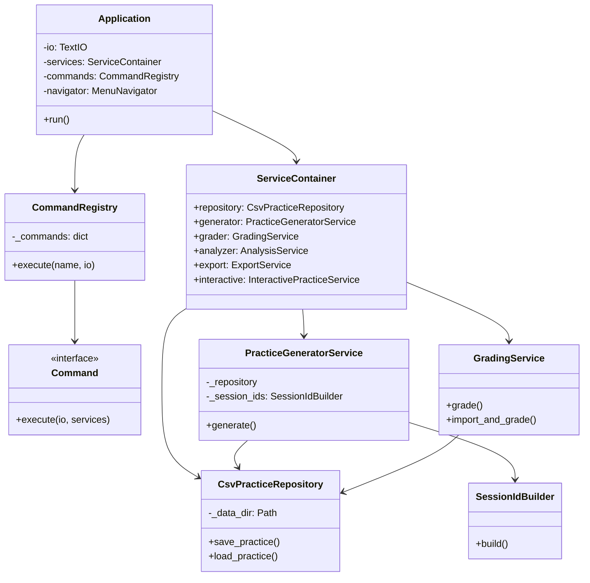

# 软件重构与交付（故事7）

## 1. 重构动机

随着功能扩展（故事1~6），原程序出现：

- 模块级函数散落，`handlers` / `repository` / `generator` 相互直接 import
- `Application` 与 `HANDLERS` 字典硬编码分发
- `DATA_DIR` 写死路径，**换机器复制源码无法运行**（缺 venv、路径不对）
- 回归测试需手工重复执行

## 2. 重构前类图（简化）



### 重构前缺点

| 问题 | 影响 |
|------|------|
| 过程式函数堆叠 | 职责边界模糊，难以定位修改点 |
| 全局 `DATA_DIR` | 测试需 monkeypatch；打包后路径错误 |
| 字典分发命令 | 菜单与实现隐式耦合 |
| 无依赖注入 | 单元测试必须打补丁才能隔离数据 |
| 模块循环依赖风险 | `generator` 动态 import `repository` |

## 3. 重构后类图



### 重构后优点

| 改进 | 收益 |
|------|------|
| 分层清晰（仓储 / 服务 / 命令 / 应用） | 易读、易扩展新菜单项 |
| `ServiceContainer` 依赖注入 | 测试传入 `tmp_path` 即可隔离 |
| Command 模式 | 菜单与业务一一对应，符合开闭原则 |
| `paths.get_data_dir()` | 开发/打包双模式路径正确 |
| 兼容层保留旧 import | 既有测试无需全部重写 |

## 4. 使用的重构方法

| 方法 | 应用 |
|------|------|
| **提取类（Extract Class）** | `CsvPracticeRepository`、`PracticeGeneratorService` 等 |
| **引入依赖注入** | `ServiceContainer` 统一装配 |
| **命令模式（Command）** | `CreatePracticeCommand` 等替代 `HANDLERS` |
| **提取方法/组件** | `SessionIdBuilder` 从 generator 独立（TDD 驱动） |
| **引入门面（Facade）** | `ServiceContainer` 对外简化依赖 |
| **搬移函数（Move Method）** | 业务逻辑从 `handlers.py` 迁入 `services/` |
| **保留适配层** | `repository.py` 等模块委托新类，平滑迁移 |
| **打包交付** | PyInstaller 单文件 exe，见 [BUILD.md](./BUILD.md) |

## 5. 可执行程序打包

```powershell
.\scripts\build.ps1
```

生成 `dist\口算练习系统.exe`，可在无 Python 环境 Windows 机器运行。

## 6. 与第5部分类图关系

- 第5部分类图见 [CLASS_DIAGRAM.md](./CLASS_DIAGRAM.md)（交互层）
- 本文档侧重**重构前后架构对比**与**服务层/仓储层**拆分
